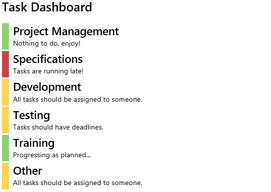

# Sample: Modular SPFX webpart



## Preparing your site

If you want to run this demo in a SharePoint Developer tenant,
you site needs to contain a task list called "Tasks" with one
additional field added to it:
- Category (choice)

You can use the provided "sitetemplate.xml" to create this list with PnP PowerShell commands:

```
$creds = get-credential
Connect-PnPOnline -Credentials $creds -Url <your_site_url>
Apply-PnPProvisioningTemplate .\sitetemplate.xml
Disconnect-PnPOnline
```

After your list has been created, go and add some data to it.

## Build instructions:

1. Make sure that you have node.js and npm installed
2. Run "npm update" this will fetch and install all required dependencies
3. Run "gulp serve" to compile and start the SharePoint workbench on your local machine.

## Test instructions:

If you want to run the included unit test in the projec, just run the command "gulp test".
