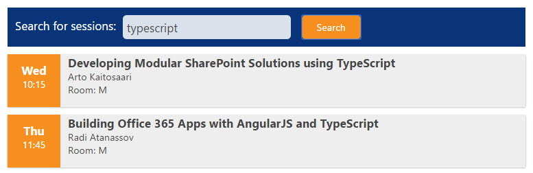

# Sample: ScriptPart with TypeScript



## Preparing your site

In order for this demo to work, your site needs to contain a list called "ESPC 16Sessions" with
at least the following fields:
- Title
- Date (date)
- Time (string)
- Speaker (string)
- Room (string)

You can use the provided "sitetemplate.xml" to create this list with PnP PowerShell commands:

```
$creds = get-credential
Connect-PnPOnline -Credentials $creds -Url <your_site_url>
Apply-PnPProvisioningTemplate .\sitetemplate.xml
Disconnect-PnPOnline
```

After your list has been created, go and add some data to it.

## Build instructions:

1. Make sure that you have node.js and npm installed
2. Run "npm update" this will fetch and install TypeScript into your node_modules folder
3. Update the site url at the bottom of "typescriptpart.html" to match your environment
3. Run "tsc" to compile

## Installation instructions:

1. Upload the following files for example to a Documents library in your site.
   - typescriptpart.html
   - typescriptpart.js
   - typescriptpart.js.map (optional, allows you to debug using typescript)
   - typescriptpart.ts (optional, allows you to debug using typescript)
2. Add a content editor webpart to your page
3. Set the content link -property of the webpart to point to the "typescriptpart.html" files
4. Reload the page and test.